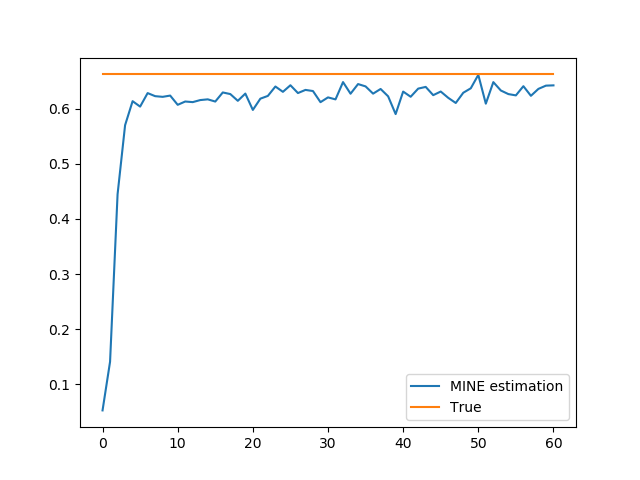
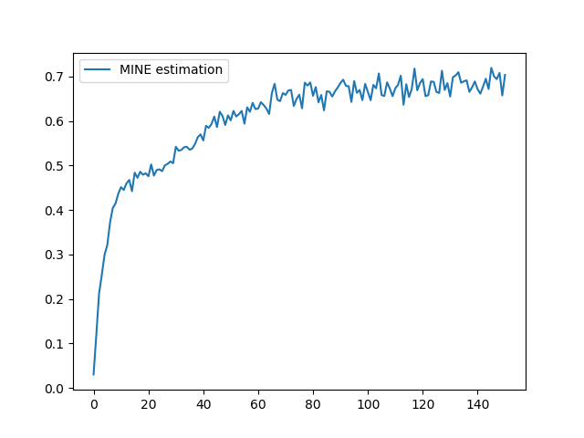

# simple-mine
A tensorflow implementation of Mutual Information Nerual Estimation

This project aims to reproduce the result of https://arxiv.org/abs/1801.04062

It is based on the repository: https://github.com/mzgubic/MINE

Univariate case:

> MINE output 0.6615455746650696

> scikit-learn output 0.6623560914314356

Multivariate case: Treat X (features) as a multivariate variable and estimate MI with y from a joint distribution point of view. 
> MINE output 0.6890636086463928

